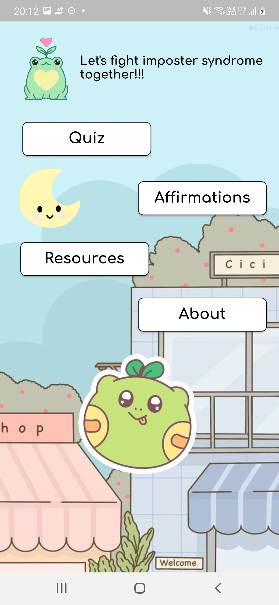
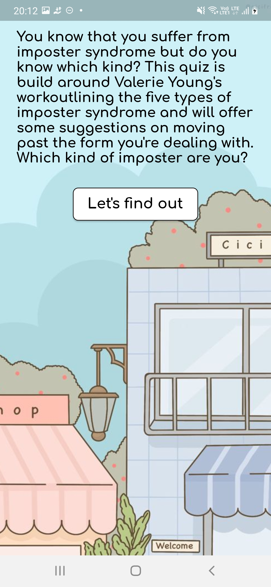
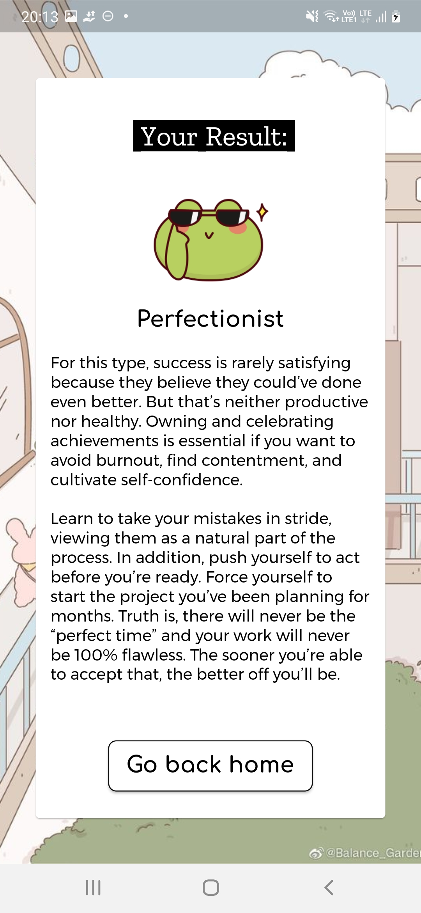
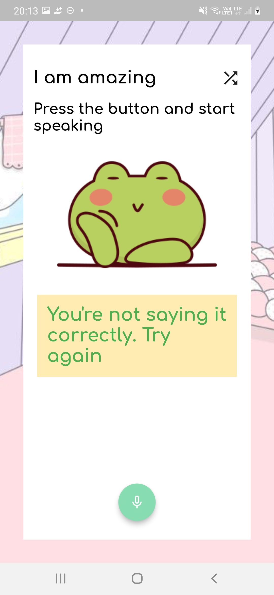

# Imposter Bubble

## About
Imposter Bubble helps people in identifying the type and recommending them books, articles where they can learn about different ways to overcome the feeling and become more confident.

## Screenshots

<pre>
     
</pre>
